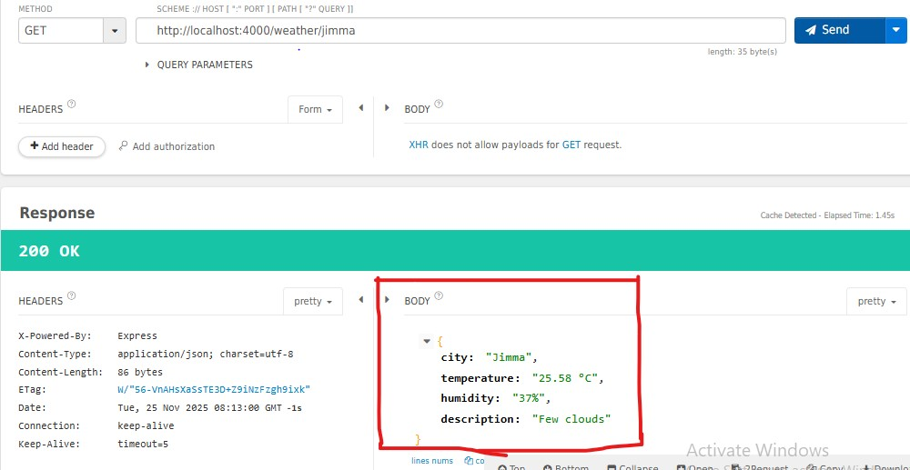
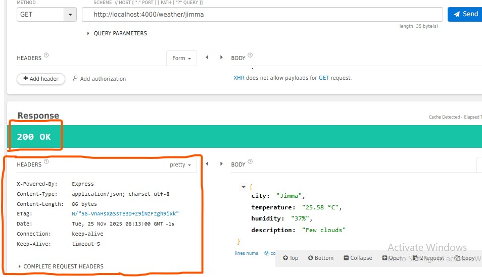

# Report on  Weather API Integration

**Group Members:**  
1. Seid Hussein  
2. Zuber Mohammed  
3. Ezedin Ebrahim  
4. Abdusemed Abdushukur  
5. Amina Ali  

## 1. Introduction
The objective of this assignment is to demonstrate **web services integration and security** by developing a client application that interacts with an external API.  
The selected web service is the **OpenWeatherMap API**, a RESTful service that provides current weather data.

The project includes:
- Consuming an external API
- Implementing API Key–based authentication
- Processing and transforming retrieved weather data
- Handling errors securely  
- Building the application using **Node.js** and **Express**

---

## 2. Implementation Steps

### ✔️ Setup Environment
- Initialized a Node.js project using `npm init`
- Installed required dependencies:
  - **Express** – server framework  
  - **Axios** – HTTP client for API requests  
  - **dotenv** – environment variable management  
- Created a `.env` file to securely store the API key

### ✔️ API Selection and Authentication
- Used **OpenWeatherMap Current Weather Data** endpoint
- Authentication handled by attaching the API key as `appid` in the query string
- API key loaded securely from `.env`

### ✔️ Server and Endpoint Creation
- Created an Express server
- Implemented the route:  GET /weather/:city
- Used Axios to fetch JSON weather data asynchronously

### ✔️ Data Retrieval and Transformation
- Parsed the weather response  
- Extracted important values:  
- Temperature  
- Humidity  
- Weather description  
- Converted temperature from **Kelvin → Celsius**
- Returned a clean, user-friendly JSON response

### ✔️ Error Handling and Logging
- Implemented `try/catch` for async operations
- Checked API response status codes
- Logged both success and error messages  
- Returned appropriate HTTP error responses (e.g., invalid city, invalid API key)

### ✔️ Testing
- Started the server locally
- Tested with:
- **curl**
- **Talend Api Tester**
- Web browser
- Tested both valid and invalid inputs

---

## 3. Tools and Technologies Used

### Programming Language
- **Node.js**

### Libraries & Frameworks
- **Express.js** – server creation  
- **Axios** – API consumption  
- **dotenv** – environment variables  

### Tools
- **VS Code** (or any IDE)
- **npm** for package management  
- **Git** for version control  
- **OpenWeatherMap API**  
- **Talend Api Tester** / **curl** for testing  

### Other
- Command-line terminal

---

## 4. Results and Observations
The application successfully retrieves, processes, and serves weather data through the custom endpoint.

### Example of a Successful JSON Response  

*(from the `/weather/:city` endpoint)*  
### Response Headers

### ✔️ Authentication Handling
- API key is passed in the query string:  ?q=London&appid=your_key
- Invalid key → API returns **401 Unauthorized**
- The server:
- Catches the error
- Logs it
- Responds back with an HTTP 401 status

### ✔️ Observations
- The design provides a **scalable client–server architecture**.
- Node.js + Express is efficient for **asynchronous API calls**.
- Need to monitor **API rate limits**, especially on the free tier.
- `.env` usage prevents exposure of sensitive API keys.
- Production recommendations:
- Use **HTTPS**
- Add **authentication layers**
- Improve rate limiting and logging

---

## 5. Conclusion
This assignment demonstrated effective integration of a **RESTful web service** using Node.js and Express, highlighting secure API key authentication and structured data processing.

**Key takeaways:**
- Asynchronous functions in Node.js improve performance during API requests.
- Error handling ensures stability during network or API failures.
- Data transformation enhances the usability of raw API responses.
- Logging supports debugging and long-term maintenance.
- Secure practices (e.g., using `.env`) help protect sensitive information.

Overall, this project shows how secure and efficient web service communication can be achieved with proper architecture and best practices.

---

